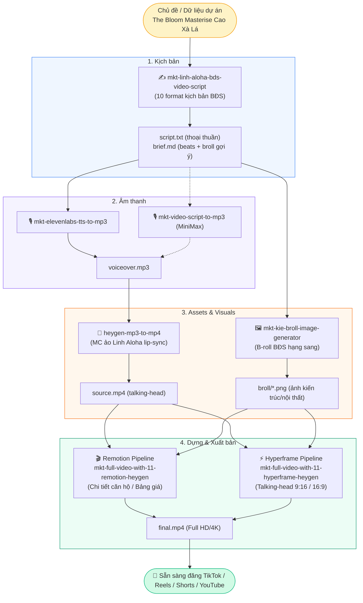

# Linh Aloha Video AI — Pipeline Sản Xuất Video BĐS Hàng Hiệu

> **Hệ thống AI Agents & Skills chuyên sâu** sản xuất video ngắn (TikTok, Reels, Shorts) và video phân tích chuyên sâu (16:9) dành riêng cho thương hiệu **Linh Aloha** — Chuyên gia Bất Động Sản Hàng Hiệu.
> Định vị thương hiệu: **"Sang trong sản phẩm — Ấm trong giọng nói"**.

---

## Mục lục

1. [Tổng quan & Triết lý vận hành](#tổng-quan--triết-lý-vận-hành)
2. [Sơ đồ Pipeline End-to-End](#sơ-đồ-pipeline-end-to-end)
3. [Danh mục Skills hiện có](#danh-mục-skills-hiện-có)
4. [Hướng dẫn sử dụng chi tiết (Step-by-Step)](#hướng-dẫn-sử-dụng-chi-tiết-step-by-step)
   - [Bước 1: Viết kịch bản chuẩn giọng Linh Aloha](#bước-1-viết-kịch-bản-chuẩn-giọng-linh-aloha)
   - [Bước 2: Tạo giọng đọc AI (TTS)](#bước-2-tạo-giọng-đọc-ai-tts)
   - [Bước 3: Tạo Avatar AI Lip-sync & Sinh ảnh B-roll](#bước-3-tạo-avatar-ai-lip-sync--sinh-ảnh-b-roll)
   - [Bước 4: Dựng video hoàn chỉnh (Remotion / Hyperframe)](#bước-4-dựng-video-hoàn-chỉnh-remotion--hyperframe)
5. [Cấu trúc thư mục & Kho dữ liệu](#cấu-trúc-thư-mục--kho-dữ-liệu)
6. [Quy tắc Brand Voice Linh Aloha (Bắt buộc)](#quy-tắc-brand-voice-linh-aloha-bắt-buộc)

---

## Tổng quan & Triết lý vận hành

1. **Brand-First (Chất riêng Linh Aloha):** Tự xưng luôn có *"em"* (`em`, `em Linh`, `em Linh Aloha`), gọi khách là *"anh chị"*. Giọng điềm tĩnh, ấm áp, thẳng thắn, đưa số liệu và dẫn chứng thực tế, không dùng chiêu trò hối thúc.
2. **Một Skill Một Việc (Modular Architecture):** Mỗi bước trong quy trình là một skill độc lập, có input/output rõ ràng bằng file (`script.txt`, `brief.md`, `voiceover.mp3`, `source.mp4`, `manifest.json`).
3. **Engine dựng video kép:**
   - **Remotion (React):** Tùy biến đồ họa chuyển động phức tạp, bóc tách mặt bằng, bảng giá, biểu đồ tài chính.
   - **Hyperframe (HTML/GSAP):** Render siêu tốc, responsive, linh hoạt cho video talking-head và infographic.
4. **Human-in-the-loop (Kiểm duyệt từng chặng):** Luôn có checkpoint sau bước kịch bản và audio trước khi render video cuối.

---

## Sơ đồ Pipeline End-to-End



---

## Danh mục Skills hiện có

### 1. Nhóm Kịch bản & Nội dung (Scriptwriting)
| Tên Skill | Đường dẫn | Chức năng chính |
|---|---|---|
| **`mkt-linh-aloha-bds-video-script`** | `.claude/skills/mkt-linh-aloha-bds-video-script/` | Kỹ năng chuẩn chuyên sâu cho Linh Aloha: áp dụng 10 format kịch bản BĐS hàng hiệu, hook 3s, signature, CTA, checklist tự kiểm. |
| **`mkt-vn-short-video-script`** | `.claude/skills/mkt-vn-short-video-script/` | Engine sinh kịch bản video ngắn đa profile (đã tích hợp profile chuẩn `linh-aloha`). |

### 2. Nhóm Giọng đọc & Âm thanh (TTS & Audio)
| Tên Skill | Đường dẫn | Chức năng chính |
|---|---|---|
| **`mkt-elevenlabs-tts-to-mp3`** | `.claude/skills/mkt-elevenlabs-tts-to-mp3/` | Chuyển `script.txt` thành audio `voiceover.mp3` qua ElevenLabs API (giọng đọc tự nhiên, ấm áp). |
| **`mkt-video-script-to-mp3`** | `.claude/skills/mkt-video-script-to-mp3/` | Chuyển kịch bản thành giọng đọc HD qua MiniMax API (`speech-2.8-hd`). |
| **`mkt-ai-video-extract-srt-segment`** | `.claude/skills/mkt-ai-video-extract-srt-segment/` | Trích xuất timecode và phụ đề SRT chính xác từ audio/video. |

### 3. Nhóm Hình ảnh & Avatar (Visuals & MC AI)
| Tên Skill | Đường dẫn | Chức năng chính |
|---|---|---|
| **`heygen-mp3-to-mp4`** | `.claude/skills/heygen-mp3-to-mp4/` | Ghép `voiceover.mp3` vào Avatar MC Linh Aloha qua HeyGen API, xuất video talking-head `source.mp4`. |
| **`mkt-kie-broll-image-generator`** | `.claude/skills/mkt-kie-broll-image-generator/` | Tự động phân tích `brief.md` để sinh ảnh B-roll kiến trúc / không gian sống phong cách BĐS hàng hiệu (`linh-aloha`) qua KIE AI (Nano Banana 2 / GPT Image 2). |

### 4. Nhóm Dựng Video Hoàn Chỉnh (Video Orchestrators)
| Tên Skill | Đường dẫn | Chức năng chính |
|---|---|---|
| **`mkt-full-video-with-11-remotion-heygen`** | `.claude/skills/mkt-full-video-with-11-remotion-heygen/` | Pipeline 9:16 Remotion: Tự động chạy TTS → HeyGen → Render composition React Remotion (headline, zoom, SFX BĐS, subtitle). |
| **`mkt-full-video-with-11-remotion-heygen-apartment-detail`** | `.claude/skills/mkt-full-video-with-11-remotion-heygen-apartment-detail/` | Pipeline Remotion chuyên sâu cho bóc tách chi tiết căn hộ, mặt bằng L1/L2, bảng giá và bài toán tài chính. |
| **`mkt-full-video-with-11-hyperframe-heygen`** | `.claude/skills/mkt-full-video-with-11-hyperframe-heygen/` | Pipeline dựng video talking-head dọc (9:16) bằng engine Hyperframe (HTML5/CSS/GSAP). |
| **`mkt-full-video-with-11-hyperframe-heygen-16-9`** | `.claude/skills/mkt-full-video-with-11-hyperframe-heygen-16-9/` | Pipeline dựng video ngang (16:9) chuyên phân tích dự án dài trên YouTube/Facebook. |
| **`mkt-hyperframe-luxury-realestate-9-16`** | `.claude/skills/mkt-hyperframe-luxury-realestate-9-16/` | Hệ thống thiết kế (Design Tokens) chuẩn BĐS hạng sang: font chữ, bảng màu champagne/gold/kem, hiệu ứng chuyển cảnh. |
| **`mkt-hyperframe-talking-head-video`** / **`16-9`** | `.claude/skills/mkt-hyperframe-talking-head-video/` | Bộ công cụ cắt cảnh, gắn infographic và sound cues đồng bộ theo giọng nói. |
| **`mkt-hyperframe-knowledge-video-heygen-9-16-lite`** | `.claude/skills/mkt-hyperframe-knowledge-video-heygen-9-16-lite/` | Dựng nhanh video chia sẻ kiến thức dạng ngắn gọn, tinh gọn. |
| **`mkt-plan-short-video-edit-16-9`** | `.claude/skills/mkt-plan-short-video-edit-16-9/` | Lập kế hoạch phân cảnh, storyboard cho video 16:9. |

### 5. Nhóm Kỹ năng Mở rộng (Codex BĐS Skills)
| Tên Skill | Đường dẫn | Chức năng chính |
|---|---|---|
| **`mkt-edit-video-bds-linh-hoat`** | `.codex/skills/mkt-edit-video-bds-linh-hoat/` | Kỹ thuật dựng video linh hoạt khi dự án mới chỉ có ảnh phối cảnh 3D (chưa có video thực tế), zoom hiệu ứng TikTok. |
| **`mkt-hyperframe-heygen-bds-proof-first-9-16`** | `.codex/skills/mkt-hyperframe-heygen-bds-proof-first-9-16/` | Phong cách dựng "Proof-first": đưa số liệu, mặt bằng và văn bản pháp lý lên trước làm bằng chứng thuyết phục. |
| **`ui-ux-pro-max`** | `.codex/skills/ui-ux-pro-max/` | Kho mẫu thiết kế giao diện, màu sắc và typography. |

---

## Hướng dẫn sử dụng chi tiết (Step-by-Step)

### Bước 1: Viết kịch bản chuẩn giọng Linh Aloha

Chỉ cần nhập câu lệnh yêu cầu kịch bản kèm chủ đề hoặc format mong muốn:

```bash
# Cách 1: Dùng trực tiếp skill chuyên sâu của Linh Aloha
/mkt-linh-aloha-bds-video-script

# Cách 2: Dùng qua multi-profile engine
/mkt-vn-short-video-script --profile linh-aloha
```

**Ví dụ câu lệnh:**
> *"Viết kịch bản video ngắn 60s phân tích căn Studio tại The Bloom Masterise Cao Xà Lá theo format Cờ xanh / Cờ đỏ."*

**Kết quả nhận được tại `output/linh-aloha/scripts/<slug>/`:**
1. `script.txt`: Lời thoại thuần túy đã được làm sạch, sẵn sàng gửi TTS.
2. `brief.md`: Kế hoạch chi tiết gồm 3 hook A/B test, nhịp phân cảnh, gợi ý chữ on-screen, gợi ý B-roll và checklist tự kiểm tra.

---

### Bước 2: Tạo giọng đọc AI (TTS)

Chuyển đổi kịch bản vừa tạo sang giọng đọc chuẩn:

```bash
# Dùng ElevenLabs (mặc định cho Linh Aloha)
/mkt-elevenlabs-tts-to-mp3 --input output/linh-aloha/scripts/<slug>/script.txt

# Hoặc dùng MiniMax HD
/mkt-video-script-to-mp3 --input output/linh-aloha/scripts/<slug>/script.txt
```

**Output:** `workspace/<slug>/audio/voiceover.mp3` (khoảng 60–90 giây, nhịp đọc 3.3–3.5 từ/giây).

---

### Bước 3: Tạo Avatar AI Lip-sync & Sinh ảnh B-roll

#### 3.1. Tạo video MC ảo nói khẩu hình:
```bash
/heygen-mp3-to-mp4 --audio workspace/<slug>/audio/voiceover.mp3
```
**Output:** `workspace/<slug>/video/source.mp4` (MC Linh Aloha nói khớp 100% âm thanh).

#### 3.2. Tự động sinh ảnh B-roll kiến trúc (nếu chưa có sẵn ảnh chụp):
```bash
/mkt-kie-broll-image-generator \
  --brief output/linh-aloha/scripts/<slug>/brief.md \
  --profile linh-aloha \
  --output_dir workspace/<slug>/broll/
```
**Output:** Thư mục ảnh `workspace/<slug>/broll/` (phòng khách sang trọng, ban công view công viên, bàn giao nội thất...) kèm file `broll-manifest.json`.

---

### Bước 4: Dựng video hoàn chỉnh (Remotion / Hyperframe)

Chọn pipeline phù hợp với định dạng video bạn cần:

#### Lựa chọn A: Video dọc 9:16 bóc tách chi tiết (Remotion)
Dành cho video phân tích giá, mặt bằng, tiện ích cần đồ họa nét và hiệu ứng âm thanh BĐS:
```bash
/mkt-full-video-with-11-remotion-heygen
# Hoặc chuyên sâu về mặt bằng căn hộ:
/mkt-full-video-with-11-remotion-heygen-apartment-detail
```

#### Lựa chọn B: Video Talking-head siêu tốc (Hyperframe)
```bash
# Video dọc 9:16
/mkt-full-video-with-11-hyperframe-heygen

# Video ngang 16:9 (YouTube)
/mkt-full-video-with-11-hyperframe-heygen-16-9
```

---

## Cấu trúc thư mục & Kho dữ liệu

```
linh.aloha.video.ai/
├── .claude/skills/               # Kho 16 skills chính của dự án
├── .codex/skills/                # Kho 3 skills bổ trợ chuyên sâu BĐS
├── workspace/
│   ├── data/                     # Kho tài liệu gốc dự án BĐS
│   │   ├── Cao xà lá và di sản.md
│   │   ├── Tổng quan dự án.md
│   │   ├── Vị trí và Kết nối.md
│   │   ├── Tiện ích và Cảnh quan.md
│   │   ├── Layout và Mặt bằng L1 L2.md
│   │   ├── Tiêu chuẩn bàn giao.md
│   │   ├── Bán hàng và Thanh toán.md
│   │   ├── 13 - Kho slogan và tagline.md
│   │   ├── _phan-tich/           # Bóc tách chiến lược nội dung & mặt bằng
│   │   └── script bds mau/       # Các kịch bản BĐS mẫu thực chiến
│   ├── remotion-project/         # Codebase React Remotion dựng video
│   │   └── src/overlays/         # Các component đồ họa (Price, Spec, Amenity...)
│   └── sfx-realestate/           # Thư viện âm thanh hiệu ứng (Whoosh, Ting, Pop...)
└── output/                       # Thư mục lưu sản phẩm xuất ra
```

---

## Quy tắc Brand Voice Linh Aloha (Bắt buộc)

Mỗi kịch bản và video sinh ra phải tuân thủ nghiêm ngặt các nguyên tắc sau:

1. **Quy tắc xưng hô:**
   - Tự xưng **LUÔN CÓ CHỮ "EM"**: *"em"*, *"em Linh"*, *"em Linh Aloha"*.
   - ❌ Tuyệt đối không xưng trống: *"Linh đây"*, *"Linh nghĩ"*.
   - Gọi khách hàng: **"anh chị"** (không dùng "các bác", "quý vị", "bạn").
2. **Câu Signature mở đầu:**
   - Lồng vào ngay sau cú đấm của Hook 3 giây đầu: *"Aloha anh chị, em Linh đây!"*
3. **Mỏ neo dự án:**
   - Tên dự án *The Bloom* lần đầu nhắc đến phải kèm mỏ neo: *"The Bloom — dự án của Masterise trên khu đất Cao Xà Lá ở Nguyễn Trãi"*.
4. **Liệt kê rõ ràng:**
   - Phải đếm số bằng lời: *"Có 3 điều em thích: 1 là... 2 là... 3 là..."*
5. **Kêu gọi hành động (CTA):**
   - Mời kết nối ấm áp: *"Anh chị inbox hoặc gọi cho em Linh Aloha theo số hotline trên màn hình, em tư vấn trực tiếp với anh chị nhé."*
   - ❌ Không dùng câu phòng thủ: *"em tư vấn thật, không hối thúc"*.
